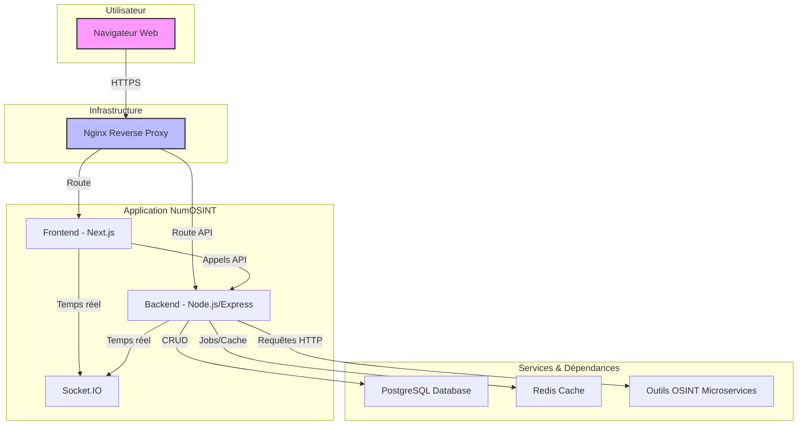

# Architecture de NumOSINT

Ce document décrit l'architecture globale de l'application NumOSINT, ses composants principaux et leurs interactions.

## Vue d'ensemble

NumOSINT est conçu comme une application web modulaire et évolutive pour l'investigation OSINT. L'architecture repose sur une séparation claire entre le frontend, le backend et un ensemble de microservices spécialisés pour les outils OSINT. Cette approche permet une meilleure maintenabilité, un déploiement indépendant des composants et une plus grande résilience.

## Diagramme d'Architecture

Le diagramme ci-dessous illustre les principaux composants de l'application et leurs flux de communication.

## Description des Composants

### 1. Frontend

-   **Technologie :** Next.js (React)
-   **Rôle :** Fournit l'interface utilisateur web pour interagir avec la plateforme. Il est responsable de l'affichage des données, de la gestion des formulaires d'investigation et de la visualisation des résultats. Il communique avec le backend via une API REST et reçoit des mises à jour en temps réel via Socket.IO.

### 2. Backend

-   **Technologie :** Node.js avec Express.js
-   **Rôle :** C'est le cœur de l'application. Il gère :
    -   La logique métier (création et gestion des investigations et des cas).
    -   L'API REST pour le frontend.
    -   L'authentification et les autorisations (à venir).
    -   L'orchestration des outils OSINT via des appels aux microservices.
    -   La communication en temps réel avec le frontend via Socket.IO pour notifier de la progression des tâches.
    -   Les interactions avec la base de données.

### 3. Base de données

-   **Technologie :** PostgreSQL
-   **ORM :** Prisma
-   **Rôle :** Stocke toutes les données persistantes de l'application, y compris :
    -   Les utilisateurs (à venir).
    -   Les cas (`Case`).
    -   Les investigations (`Investigation`).
    -   Les indicateurs (`Indicator`) : les données d'entrée et celles découvertes.
    -   Les résultats (`Result`) bruts des outils.
    -   Les logs et les notifications.

### 4. Microservices OSINT

-   **Technologie :** Docker, avec des serveurs spécifiques à chaque outil (Go, Python).
-   **Rôle :** Chaque outil OSINT (Maigret, Mosint, etc.) est encapsulé dans son propre microservice. Cette approche isole les dépendances et les environnements d'exécution. Le backend communique avec ces services via des API REST internes.

### 5. Redis

-   **Technologie :** Redis
-   **Rôle :** Utilisé principalement pour la mise en cache de données fréquemment accédées et potentiellement pour gérer des files d'attente de tâches (jobs) pour les opérations asynchrones.

### 6. Nginx

-   **Technologie :** Nginx
-   **Rôle :** Agit comme un reverse proxy. Il reçoit toutes les requêtes entrantes, sert le frontend et redirige les appels API vers le backend. Il est également responsable de la terminaison SSL en production.

## Flux de Données : Lancer une Nouvelle Investigation

1.  L'utilisateur soumet un formulaire d'investigation depuis le **Frontend**.
2.  Le **Frontend** envoie une requête POST à l'API du **Backend** avec les indicateurs initiaux.
3.  Le **Backend** crée une nouvelle entrée `Investigation` dans la base de données **PostgreSQL**.
4.  Le service d'orchestration du **Backend** démarre le flux de travail de l'investigation.
5.  Pour chaque outil pertinent, le **Backend** envoie des requêtes HTTP aux **Microservices OSINT** correspondants.
6.  Les **Microservices** exécutent leurs tâches et retournent les résultats bruts au **Backend**.
7.  Le **Backend** traite et stocke ces résultats dans la base de données.
8.  Tout au long du processus, le **Backend** envoie des messages via **Socket.IO** au **Frontend** pour mettre à jour l'interface utilisateur en temps réel sur la progression.
9.  Une fois l'investigation terminée, les résultats finaux sont disponibles pour consultation via l'API.