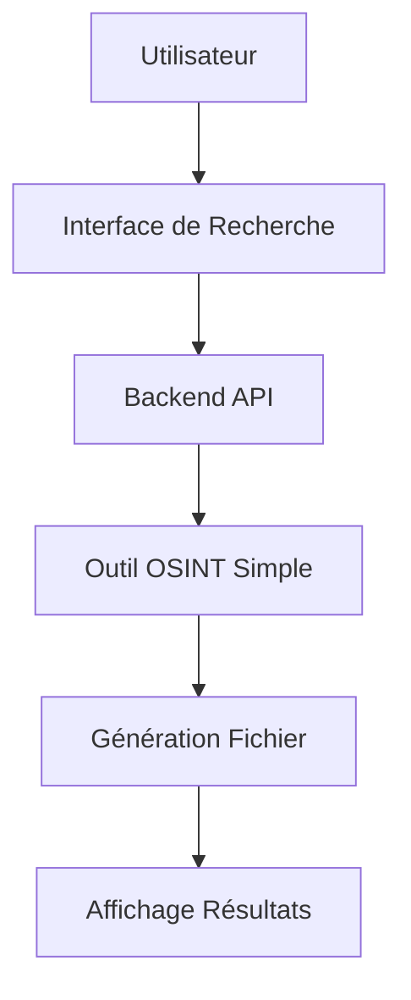
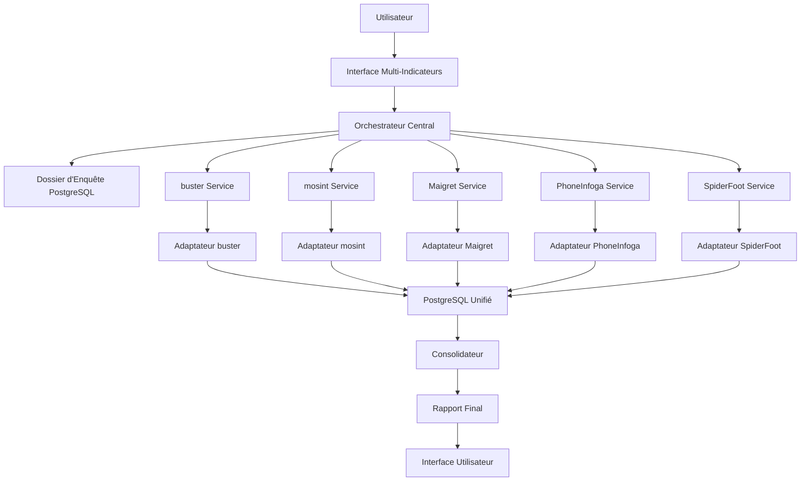

# Plan de Migration : Outil OSINT Simple → Application Multi-Outils

## Vue d'Ensemble

**Objectif** : Migrer d'un outil simple vers une application unifiée utilisant plusieurs outils OSINT spécialisés selon un flux orchestré.

**Philosophie** : Progression de la précision chirurgicale à la couverture totale, avec enrichissement continu des données.

## Stack d'Outils Intégrés

| Étape | Outil | Rôle | Justification |
|-------|-------|------|---------------|
| 1 | buster | Génération (Nom → E-mail) | Le plus complet pour générer et valider des e-mails |
| 2 | mosint | Analyse d'E-mail | Le plus puissant pour l'analyse d'e-mails et fuites de données |
| 3 | Maigret | Analyse de Nom d'Utilisateur | Le meilleur pour l'analyse de profils avec recherche récursive |
| 4 | PhoneInfoga | Analyse de Téléphone | Standard avec API REST facile à intégrer |
| 5 | SpiderFoot | Scan Exhaustif Final | Moteur d'automatisation le plus complet |

---

## Structure du Flux Unifié

### Flux Actuel (Simple)


### Flux Unifié Cible (Multi-Outils)


### États et Transitions du Flux

#### 1. État d'Initialisation
```typescript
interface InvestigationState {
  id: string;
  status: 'initializing' | 'enriching' | 'scanning' | 'consolidating' | 'completed' | 'failed';
  progress: number; // 0-100
  currentStep: 'buster' | 'mosint' | 'maigret' | 'phoneinfoga' | 'spiderfoot' | 'consolidation';
  indicators: IndicatorCollection;
  results: UnifiedResultSet;
  createdAt: Date;
  updatedAt: Date;
}

interface IndicatorCollection {
  names: string[];
  emails: string[];
  usernames: string[];
  phones: string[];
  ips: string[];
  domains: string[];
}
```

#### 2. Progression du Flux
```typescript
enum FlowStep {
  INITIALIZATION = 'initialization',      // 0-10%
  BUSTER_GENERATION = 'buster',          // 10-25%
  MOSINT_ANALYSIS = 'mosint',            // 25-40%
  MAIGRET_ANALYSIS = 'maigret',          // 40-60%
  PHONEINFOGA_ANALYSIS = 'phoneinfoga',  // 60-75%
  SPIDERFOOT_SCAN = 'spiderfoot',        // 75-90%
  CONSOLIDATION = 'consolidation',        // 90-100%
  COMPLETED = 'completed'                 // 100%
}
```

### Architecture des Données

#### Modèle PostgreSQL/Prisma
```prisma
model Investigation {
  id          String   @id @default(cuid())
  status      InvestigationStatus
  progress    Int      @default(0)
  currentStep String?
  createdAt   DateTime @default(now())
  updatedAt   DateTime @updatedAt
  
  // Données d'entrée
  inputData   Json
  
  // Relations
  indicators  Indicator[]
  results     Result[]
  logs        InvestigationLog[]
  
  @@map("investigations")
}

model Indicator {
  id             String          @id @default(cuid())
  investigationId String
  type           IndicatorType
  value          String
  source         String          // buster, mosint, maigret, etc.
  confidence     Float           @default(0.5)
  verified       Boolean         @default(false)
  createdAt      DateTime        @default(now())
  
  investigation  Investigation   @relation(fields: [investigationId], references: [id])
  results        Result[]
  
  @@map("indicators")
}

model Result {
  id             String     @id @default(cuid())
  investigationId String
  indicatorId    String
  toolSource     String     // buster, mosint, maigret, phoneinfoga, spiderfoot
  data           Json
  score          Float      @default(0.0)
  createdAt      DateTime   @default(now())
  
  investigation  Investigation @relation(fields: [investigationId], references: [id])
  indicator      Indicator     @relation(fields: [indicatorId], references: [id])
  
  @@map("results")
}

enum InvestigationStatus {
  INITIALIZING
  ENRICHING
  SCANNING
  CONSOLIDATING
  COMPLETED
  FAILED
}

enum IndicatorType {
  NAME
  EMAIL
  USERNAME
  PHONE
  IP
  DOMAIN
  URL
}
```

### Flux de Données Détaillé

#### Étape 1 : Initialisation (0-10%)
```typescript
// Frontend → Backend
const initializeInvestigation = async (input: InvestigationInput) => {
  const investigation = await prisma.investigation.create({
    data: {
      status: 'INITIALIZING',
      progress: 5,
      inputData: input,
      indicators: {
        create: extractInitialIndicators(input)
      }
    }
  });
  
  // Démarrer l'orchestrateur
  await orchestrator.start(investigation.id);
  return investigation;
};
```

#### Étape 2 : Enrichissement Spécialisé (10-75%)
```typescript
// Orchestrateur → Services spécialisés
const enrichmentFlow = async (investigationId: string) => {
  const investigation = await getInvestigation(investigationId);
  
  // 1. Génération d'emails (buster)
  if (hasNames(investigation.indicators)) {
    const emails = await busterService.generateEmails(investigation.indicators.names);
    await saveIndicators(investigationId, emails, 'buster');
    await updateProgress(investigationId, 25);
  }
  
  // 2. Analyse d'emails (mosint)
  if (hasEmails(investigation.indicators)) {
    const emailAnalysis = await mosintService.analyzeEmails(investigation.indicators.emails);
    await saveResults(investigationId, emailAnalysis, 'mosint');
    await updateProgress(investigationId, 40);
  }
  
  // 3. Analyse de usernames (maigret)
  if (hasUsernames(investigation.indicators)) {
    const profiles = await maigretService.searchProfiles(investigation.indicators.usernames);
    await saveResults(investigationId, profiles, 'maigret');
    await updateProgress(investigationId, 60);
  }
  
  // 4. Analyse de téléphones (phoneinfoga)
  if (hasPhones(investigation.indicators)) {
    const phoneData = await phoneinfogaService.analyzePhones(investigation.indicators.phones);
    await saveResults(investigationId, phoneData, 'phoneinfoga');
    await updateProgress(investigationId, 75);
  }
};
```

#### Étape 3 : Scan Exhaustif (75-90%)
```typescript
// SpiderFoot avec tous les indicateurs collectés
const comprehensiveScan = async (investigationId: string) => {
  const allIndicators = await getAllIndicators(investigationId);
  
  const spiderFootConfig = {
    targets: allIndicators.map(i => i.value),
    modules: ['ALL'],
    options: {
      maxDepth: 3,
      timeout: 300
    }
  };
  
  const scanResults = await spiderFootService.startScan(spiderFootConfig);
  await saveResults(investigationId, scanResults, 'spiderfoot');
  await updateProgress(investigationId, 90);
};
```

#### Étape 4 : Consolidation (90-100%)
```typescript
// Fusion et déduplication
const consolidateResults = async (investigationId: string) => {
  const allResults = await getAllResults(investigationId);
  
  // Déduplication
  const deduplicated = await deduplicateResults(allResults);
  
  // Scoring et prioritisation
  const scored = await scoreResults(deduplicated);
  
  // Génération du rapport final
  const finalReport = await generateUnifiedReport(scored);
  
  await updateInvestigation(investigationId, {
    status: 'COMPLETED',
    progress: 100,
    finalReport
  });
};
```

### Gestion des Erreurs et Retry

#### Stratégie de Résilience
```typescript
interface StepConfig {
  maxRetries: number;
  timeout: number;
  fallbackStrategy: 'skip' | 'partial' | 'fail';
}

const stepConfigs: Record<string, StepConfig> = {
  buster: { maxRetries: 3, timeout: 30000, fallbackStrategy: 'skip' },
  mosint: { maxRetries: 2, timeout: 60000, fallbackStrategy: 'partial' },
  maigret: { maxRetries: 3, timeout: 120000, fallbackStrategy: 'partial' },
  phoneinfoga: { maxRetries: 2, timeout: 45000, fallbackStrategy: 'skip' },
  spiderfoot: { maxRetries: 1, timeout: 300000, fallbackStrategy: 'partial' }
};
```

#### Monitoring et Logging
```typescript
// Logging en temps réel
const logInvestigationStep = async (investigationId: string, step: string, message: string) => {
  await prisma.investigationLog.create({
    data: {
      investigationId,
      step,
      message,
      timestamp: new Date()
    }
  });
  
  // Notification temps réel via WebSocket
  io.to(investigationId).emit('log', { step, message, timestamp: new Date() });
};
```

---

## Phase 1 : Architecture et Infrastructure

### 1.1 Refactoring du Backend

#### Tâches Core
- [ ] **Créer le système d'orchestration central**
  - Développer `OrchestratorService` pour gérer le flux multi-outils
  - Implémenter le système de "dossier d'enquête" centralisé
  - Créer la gestion des états des tâches multi-étapes

- [ ] **Intégration des outils OSINT**
  - Développer `BusterService` pour génération/validation d'e-mails
  - Développer `MosintService` pour analyse d'e-mails
  - Développer `MaigretService` pour analyse de noms d'utilisateur
  - Développer `PhoneInfogaService` pour analyse de téléphones
  - Développer `SpiderFootService` pour scan exhaustif final

- [ ] **Système de gestion des données**
  - Créer le modèle `InvestigationFolder` (dossier d'enquête)
  - Implémenter la gestion des indicateurs multi-sources
  - Développer le système de déduplication automatique
  - Créer le système d'extraction d'indicateurs inter-outils

- [ ] **Migration Fichiers → PostgreSQL/Prisma**
  - Configurer PostgreSQL comme base de données principale
  - Implémenter Prisma comme ORM pour la gestion des données
  - Créer le schéma de base de données unifié pour tous les outils OSINT
  - Développer les modèles Prisma pour chaque type de données (emails, profils, téléphones, etc.)
  - Créer le système de migration des rapports existants depuis les fichiers
  - Implémenter les adaptateurs de données pour chaque outil OSINT

#### Tâches Techniques
- [ ] **Configuration et déploiement**
  - Dockeriser chaque outil OSINT
  - Créer le docker-compose unifié avec PostgreSQL
  - Configurer les volumes de données persistantes
  - Implémenter le système de configuration centralisé

- [ ] **Configuration PostgreSQL/Prisma**
  - Configurer PostgreSQL en conteneur Docker
  - Initialiser Prisma avec les schémas de base
  - Créer les migrations initiales Prisma
  - Configurer les connexions sécurisées à la base
  - Implémenter les seeds pour les données de test
  - Créer les environnements de développement/production

- [ ] **APIs et Communication**
  - Créer les adaptateurs pour chaque outil
  - Développer les parseurs de résultats spécialisés
  - Implémenter la communication inter-services
  - Créer le système de monitoring des tâches

### 1.2 Refactoring du Frontend

#### Tâches UI/UX
- [ ] **Interface de flux unifié**
  - Créer le composant `InvestigationDashboard`
  - Développer le `MultiStepProgressIndicator`
  - Implémenter l'interface de gestion des dossiers d'enquête
  - Créer les vues spécialisées par type d'outil

- [ ] **Gestion des états complexes**
  - Refactorer `useSearch` vers `useInvestigation`
  - Implémenter la gestion des états multi-étapes
  - Créer le système de notifications enrichi
  - Développer l'interface de logs en temps réel

#### Tâches Techniques Frontend
- [ ] **Composants spécialisés**
  - Créer `EmailAnalysisView` pour mosint
  - Créer `UsernameAnalysisView` pour Maigret
  - Créer `PhoneAnalysisView` pour PhoneInfoga
  - Créer `ComprehensiveReportView` pour SpiderFoot

- [ ] **Migration des composants vers PostgreSQL**
  - Refactorer tous les composants de données pour utiliser PostgreSQL au lieu des fichiers
  - Créer les hooks React pour les requêtes Prisma (`useInvestigationData`, `useResults`, etc.)
  - Adapter les composants existants pour consommer les données depuis l'API PostgreSQL
  - Implémenter la pagination et le filtrage côté serveur
  - Créer les composants de visualisation des données unifiées
  - Développer les interfaces de gestion des rapports en base

---

## Phase 2 : Implémentation du Flux Unifié

### 2.1 Étape 0 : Initialisation

- [ ] **Système d'entrée flexible**
  - Créer l'interface multi-indicateurs (Nom, E-mail, Username, Téléphone)
  - Implémenter la validation et normalisation des entrées
  - Développer le système de création de dossiers d'enquête
  - Créer l'interface de configuration de recherche

- [ ] **Configuration Base de Données**
  - Finaliser le schéma PostgreSQL/Prisma
  - Créer les tables pour les investigations, indicateurs, et résultats
  - Implémenter les relations entre les entités
  - Configurer les index pour optimiser les performances

### 2.2 Étape 1 : Enrichissement Spécialisé

#### Génération d'e-mails (buster)
- [ ] **Intégration buster**
  - Créer l'API wrapper pour buster
  - Implémenter la génération d'e-mails à partir du nom
  - Développer la validation d'e-mails
  - Créer le système d'ajout automatique au dossier
  - **Unification des données** : Créer l'adaptateur pour stocker les résultats buster dans PostgreSQL
  - Développer le parseur standardisé pour les sorties buster → format DB unifié

#### Analyse d'e-mails (mosint)
- [ ] **Intégration mosint**
  - Créer l'API wrapper pour mosint
  - Implémenter l'analyse des fuites de données
  - Développer l'extraction d'indicateurs supplémentaires
  - Créer le système d'enrichissement du dossier
  - **Unification des données** : Créer l'adaptateur pour stocker les résultats mosint dans PostgreSQL
  - Développer le parseur standardisé pour les sorties mosint → format DB unifié

#### Analyse de noms d'utilisateur (Maigret)
- [ ] **Intégration Maigret**
  - Créer l'API wrapper pour Maigret
  - Implémenter la recherche récursive
  - Développer la gestion des permutations de noms
  - Créer l'extraction d'indicateurs de profils
  - **Unification des données** : Créer l'adaptateur pour stocker les résultats Maigret dans PostgreSQL
  - Développer le parseur standardisé pour les sorties Maigret → format DB unifié

#### Analyse de téléphones (PhoneInfoga)
- [ ] **Intégration PhoneInfoga**
  - Créer l'API wrapper pour PhoneInfoga
  - Implémenter l'analyse des numéros de téléphone
  - Développer l'extraction d'informations géographiques
  - Créer l'enrichissement du dossier avec les données téléphoniques
  - **Unification des données** : Créer l'adaptateur pour stocker les résultats PhoneInfoga dans PostgreSQL
  - Développer le parseur standardisé pour les sorties PhoneInfoga → format DB unifié

### 2.3 Étape 2 : Scan Exhaustif (SpiderFoot)

- [ ] **Intégration SpiderFoot**
  - Créer l'API wrapper pour SpiderFoot
  - Implémenter la configuration automatique des cibles
  - Développer le système de scan complet
  - Créer la récupération des rapports JSON
  - **Unification des données** : Créer l'adaptateur pour stocker les résultats SpiderFoot dans PostgreSQL
  - Développer le parseur standardisé pour les sorties SpiderFoot → format DB unifié

### 2.4 Étape 3 : Consolidation et Rapport Final

- [ ] **Système de fusion des données**
  - Développer l'algorithme de fusion des résultats depuis PostgreSQL
  - Implémenter la déduplication intelligente au niveau DB
  - Créer le système de scoring des informations en base
  - Développer la génération de rapport unifié depuis PostgreSQL

- [ ] **Migration et Nettoyage**
  - Créer le script de migration des anciens rapports fichiers → PostgreSQL
  - Implémenter la validation des données migrées
  - Développer le système de nettoyage des anciens fichiers
  - Créer les procédures de sauvegarde et restauration PostgreSQL

---

## Phase 3 : Fonctionnalités Avancées

### 3.1 Système de Workflow

- [ ] **Orchestration intelligente**
  - Créer le système de dépendances entre étapes
  - Implémenter la gestion des erreurs et retry
  - Développer la parallélisation des tâches
  - Créer le système de priorités

- [ ] **Monitoring et Logging**
  - Implémenter le monitoring en temps réel
  - Créer le système de logs détaillés
  - Développer les métriques de performance
  - Créer l'interface de debugging

### 3.2 Gestion des Données

- [ ] **Persistance et Historique PostgreSQL**
  - Créer le système de sauvegarde des dossiers en base
  - Implémenter l'historique des enquêtes avec versioning
  - Développer le système d'export/import depuis PostgreSQL
  - Créer la gestion des templates d'enquête en base
  - Implémenter l'archivage automatique des anciennes données
  - Créer les vues PostgreSQL pour les rapports agrégés

- [ ] **Sécurité et Confidentialité PostgreSQL**
  - Implémenter le chiffrement des données sensibles au niveau DB
  - Créer le système de gestion des permissions avec Row Level Security
  - Développer l'audit trail avec trigger PostgreSQL
  - Créer la gestion de la rétention des données avec des jobs automatiques
  - Implémenter la sauvegarde chiffrée des données critiques
  - Créer les politiques de sécurité au niveau base de données

- [ ] **Optimisation et Performance PostgreSQL**
  - Créer les index optimisés pour les requêtes de recherche
  - Implémenter la recherche full-text avec PostgreSQL
  - Développer les vues matérialisées pour les rapports complexes
  - Créer le système de cache Redis pour les requêtes fréquentes
  - Implémenter la compression des données anciennes
  - Créer le monitoring des performances PostgreSQL

### 3.3 Interface Utilisateur Avancée

- [ ] **Visualisation des données**
  - Créer les graphiques de relations
  - Implémenter la timeline des découvertes
  - Développer les cartes géographiques
  - Créer les diagrammes de réseau

- [ ] **Collaboration et Partage**
  - Créer le système de partage de dossiers
  - Implémenter les commentaires et annotations
  - Développer l'export en différents formats
  - Créer les rapports automatisés

---

## Phase 4 : Optimisation et Déploiement

### 4.1 Performance et Scalabilité

- [ ] **Optimisation des performances**
  - Implémenter le cache intelligent
  - Créer le système de queue pour les tâches longues
  - Développer l'optimisation des requêtes
  - Créer le système de pagination intelligent

- [ ] **Scalabilité horizontale**
  - Implémenter la distribution des tâches
  - Créer le load balancing
  - Développer la gestion des ressources
  - Créer le système de clustering

### 4.2 Tests et Qualité

- [ ] **Tests complets**
  - Créer les tests unitaires pour chaque service
  - Implémenter les tests d'intégration
  - Développer les tests de performance
  - Créer les tests de sécurité

- [ ] **Tests PostgreSQL/Prisma**
  - Créer les tests unitaires pour les modèles Prisma
  - Implémenter les tests d'intégration base de données
  - Développer les tests de performance des requêtes
  - Créer les tests de migration des données
  - Implémenter les tests de sauvegarde/restauration
  - Créer les tests de sécurité des données

- [ ] **Documentation et Formation**
  - Créer la documentation technique
  - Implémenter la documentation utilisateur
  - Développer les tutoriels
  - Créer les guides de déploiement

### 4.3 Déploiement et Maintenance

- [ ] **Déploiement production**
  - Créer les scripts de déploiement
  - Implémenter la CI/CD
  - Développer la surveillance production
  - Créer les procédures de rollback

- [ ] **Maintenance et Support**
  - Créer le système de mise à jour
  - Implémenter la télémétrie
  - Développer le support utilisateur
  - Créer les procédures de maintenance

---

## Chronologie Estimée

### Sprint 1-2 (4 semaines) : Phase 1
- Infrastructure de base
- Intégration des outils individuels
- Interface utilisateur de base

### Sprint 3-4 (4 semaines) : Phase 2
- Flux unifié complet
- Orchestration des étapes
- Consolidation des données

### Sprint 5-6 (4 semaines) : Phase 3
- Fonctionnalités avancées
- Visualisation des données
- Sécurité et persistance

### Sprint 7-8 (4 semaines) : Phase 4
- Optimisation et tests
- Déploiement production
- Documentation et formation

## Risques et Mitigation

### Risques Techniques
- **Complexité d'intégration** : Tests intensifs de chaque outil
- **Performance** : Profiling et optimisation continue
- **Stabilité** : Monitoring et alertes en temps réel

### Risques Fonctionnels
- **Données incohérentes** : Validation et normalisation strictes
- **Erreurs en cascade** : Isolation des erreurs par composant
- **UX complexe** : Tests utilisateur itératifs

### Risques de Projet
- **Délais** : Priorisation des fonctionnalités core
- **Ressources** : Parallélisation des développements
- **Qualité** : Revues de code et tests automatisés

---

## Définition of Done

### Critères de Succès
- [ ] Tous les outils OSINT sont intégrés et fonctionnels
- [ ] Le flux unifié fonctionne de bout en bout
- [ ] L'interface utilisateur est intuitive et responsive
- [ ] Les performances sont acceptables (< 30s par étape)
- [ ] La sécurité des données est garantie
- [ ] La documentation est complète et à jour

### Critères de Succès PostgreSQL/Prisma
- [ ] Migration complète des fichiers vers PostgreSQL réussie
- [ ] Tous les outils OSINT stockent leurs données dans un format unifié
- [ ] Les composants frontend consomment les données depuis PostgreSQL
- [ ] Les performances des requêtes sont optimales (< 100ms pour les requêtes simples)
- [ ] La sécurité des données est renforcée avec RLS et chiffrement
- [ ] Le système de sauvegarde/restauration fonctionne parfaitement

### Métriques de Performance
- **Temps de réponse** : < 30 secondes par étape
- **Taux de réussite** : > 95% pour chaque outil
- **Disponibilité** : > 99% en production
- **Satisfaction utilisateur** : > 8/10 dans les tests

---

## Conclusion

Cette migration représente une évolution majeure vers une plateforme OSINT complète et automatisée. Le succès dépendra de l'exécution rigoureuse de chaque phase, avec une attention particulière à l'intégration des outils et à l'expérience utilisateur.

### Points Critiques de la Migration

1. **Migration PostgreSQL/Prisma** : La transition du stockage fichier vers base de données est fondamentale pour la scalabilité et la cohérence des données.

2. **Unification des Formats** : Chaque outil OSINT doit avoir son adaptateur pour normaliser les données dans un format unifié compatible avec PostgreSQL.

3. **Refactoring Frontend** : Tous les composants doivent être adaptés pour consommer les données depuis l'API PostgreSQL plutôt que depuis les fichiers.

4. **Performance et Sécurité** : L'optimisation des requêtes et la sécurisation des données sensibles sont essentielles pour le succès en production.

La migration vers PostgreSQL/Prisma permettra une meilleure gestion des données, des performances optimisées, et une foundation solide pour les fonctionnalités avancées futures. 