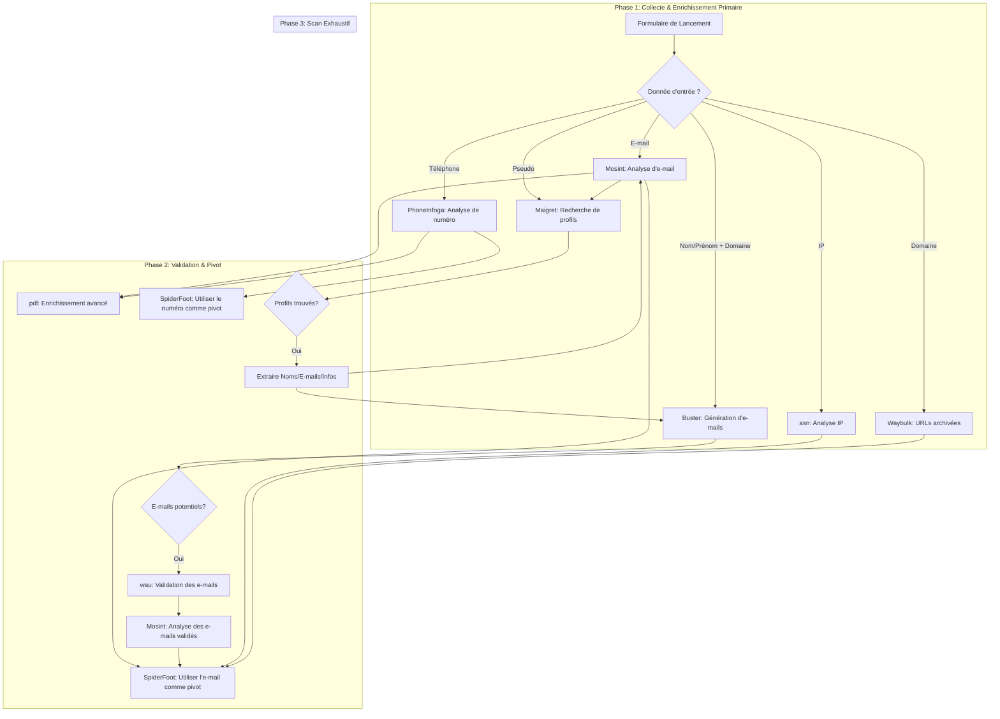

# Plan d'Intégration et Recommandations UI/UX pour NumOSINT

Ce document détaille l'architecture du workflow dynamique et le plan d'intégration complet pour chaque fonctionnalité des outils OSINT.

## 1. Optimisation du Flux d'Investigation : Le Workflow Dynamique

Un workflow dynamique qui s'adapte aux données d'entrée est essentiel. L'objectif est de lancer l'outil le plus pertinent en premier pour obtenir un "pivot" (une donnée clé comme un e-mail ou un pseudo validé) et ensuite d'utiliser ce pivot pour enrichir l'enquête.

### Diagramme du Workflow

## 2. Intégration des Nouveaux Outils : `wau`, `waybulk`, `asn` et `pdl`

*   **`wau` (Who Are You)**
    *   **Valeur Ajoutée :** Spécialiste de la **validation d'e-mails**. Il va au-delà de la simple vérification syntaxique en tentant de confirmer auprès du serveur mail si une boîte existe réellement.
    *   **Rôle :** **Complément**. Il ne remplace ni `Buster` (génération) ni `Mosint` (analyse).
    *   **Intégration :** Doit être appelé juste après `Buster` pour qualifier la liste d'e-mails générés.

*   **`waybulk`**
    *   **Valeur Ajoutée :** **Archéologie numérique**. Découvrir d'anciennes pages d'un site web est une mine d'or pour comprendre l'historique d'une entité.
    *   **Rôle :** **Nouvelle capacité**.
    *   **Intégration :** Se déclenche dès qu'un **nom de domaine** est une entrée.

*   **`asn` (ASN/IP Intel)**
    *   **Valeur Ajoutée :** **Contexte réseau**. Fournit des informations cruciales sur une adresse IP (propriétaire, géolocalisation, réputation).
    *   **Rôle :** **Enrichissement d'IP**. Essentiel pour qualifier les adresses IP découvertes.
    *   **Intégration :** Doit être appelé chaque fois qu'un indicateur **IP** est créé ou traité.

*   **`peopledatalabs` (PDL)**
    *   **Valeur Ajoutée :** **Enrichissement de profils professionnels**. Source de données commerciales extrêmement riche pour les informations sur les personnes.
    *   **Rôle :** **Enrichissement avancé (premium)**.
    *   **Intégration :** Peut être déclenché manuellement ou automatiquement sur des indicateurs **E-mail** ou **Téléphone** de haute confiance. Nécessite une clé API.

## 3. Exploitation Complète des Fonctionnalités (Plan UI/UX)

### Buster

| Fonctionnalité | Objectif (Question de l'enquêteur) | Affichage (Section UI) | Composant Shadcn/UI Suggéré |
| :--- | :--- | :--- | :--- |
| **Génération d'e-mails** | Quels sont les e-mails possibles pour cette personne dans cette entreprise ? | Section "Identités Numériques" / "E-mails" | `Table` avec colonnes : E-mail, Statut (Validé par wau), Source (Généré). |
| **Comptes sociaux** | Cet e-mail est-il lié à des profils sociaux connus ? | Sous-section de l'e-mail analysé | `Card` pour chaque profil trouvé, avec logo, nom et lien. Utiliser un `Avatar` pour le visuel. |
| **Fuites de données (breaches)** | Cet e-mail a-t-il été compromis dans une fuite de données connue ? | Section "Sécurité & Exposition" | `Alert` avec `AlertTitle` ("Fuite de données détectée !") et `AlertDescription` listant les brèches. |
| **Liens (Google, Twitter, etc.)** | Où cet e-mail apparaît-il publiquement sur le web ? | Section "Empreinte Numérique" | `Accordion` où chaque item est une source (Google, Twitter) et le contenu est une liste de liens. |
| **Domaines enregistrés (Reverse Whois)** | Quels autres domaines cette personne a-t-elle enregistrés avec cet e-mail ? | Section "Actifs Numériques" | `Table` avec colonnes : Domaine, Date d'enregistrement, Registrar. |
| **Recherche d'e-mail par pseudo** | Quel est l'e-mail associé à ce pseudo ? | Section "Identités Numériques" | Afficher l'e-mail trouvé comme résultat principal, prêt à être analysé par `Mosint`. |

### Mosint

| Fonctionnalité | Objectif (Question de l'enquêteur) | Affichage (Section UI) | Composant Shadcn/UI Suggéré |
| :--- | :--- | :--- | :--- |
| **Vérification (Syntaxe, Comptes, etc.)** | Cet e-mail est-il valide et actif sur des plateformes clés ? | En-tête de la section de l'e-mail | `Badge` (Success: "Valide", Destructive: "Invalide"). `Card` pour les comptes trouvés. |
| **Recherche Pastebin** | L'e-mail est-il mentionné dans des "pastes" ? | Section "Sécurité & Exposition" | `Accordion` avec une liste des liens Pastebin. |
| **Recherche Google** | Quels sont les résultats de recherche Google pour cet e-mail ? | Section "Empreinte Numérique" | `Card` pour chaque résultat pertinent, avec titre, snippet et lien. |
| **Lookup HaveIBeenPwned** | Confirmer les fuites de données via l'API HIBP. | Section "Sécurité & Exposition" | Intégrer les résultats dans la `Alert` des fuites, avec plus de détails. |
| **Réputation de l'e-mail** | Cet e-mail est-il considéré comme risqué ou spammy ? | En-tête de la section de l'e-mail | `Badge` avec code couleur (Vert: Bonne, Orange: Douteuse, Rouge: Mauvaise). |
| **Lookup IP (IPApi)** | D'où proviennent les serveurs mail de ce domaine ? | Section "Infrastructure Technique" | `Card` avec les détails de l'IP : FAI, géolocalisation (avec une petite carte si possible). |

### Maigret

| Fonctionnalité | Objectif (Question de l'enquêteur) | Affichage (Section UI) | Composant Shadcn/UI Suggéré |
| :--- | :--- | :--- | :--- |
| **Recherche de profils (+400 sites)** | Où puis-je trouver cette personne sur Internet en utilisant son pseudo ? | Section "Profils en Ligne" | `Grid` de `Card`. Chaque carte représente un profil trouvé avec le logo du site, le pseudo et un lien. |
| **Parsing des pages de profil** | Quelles informations puis-je extraire de ces profils ? | Dans la `Card` de chaque profil | `Tooltip` ou `Popover` sur la carte pour afficher les infos extraites (Nom, Bio, autres liens). |
| **Recherche récursive** | Quels nouveaux pseudos ou infos puis-je trouver à partir des profils découverts ? | Bouton "Lancer une recherche récursive" | `Button` sur la section "Profils en Ligne". Les nouveaux résultats alimentent la grille. |
| **Recherche par tags** | Montre-moi uniquement les profils sur des sites de "gaming" ou russes. | Filtres au-dessus de la grille de profils | `Select` ou `Checkbox` pour filtrer les résultats par tags. |

### PhoneInfoga

| Fonctionnalité | Objectif (Question de l'enquêteur) | Affichage (Section UI) | Composant Shadcn/UI Suggéré |
| :--- | :--- | :--- | :--- |
| **Informations de base** | À qui appartient ce numéro et d'où vient-il ? | En-tête de la section "Analyse Téléphone" | `Card` avec les infos clés : Pays (`Avatar` avec drapeau), Opérateur, Type de ligne. |
| **Footprinting OSINT** | Quelles traces ce numéro a-t-il laissées sur le web ? | Section "Empreinte Numérique" | `Accordion` avec des items pour "Réseaux Sociaux", "Annuaires", etc. |
| **Vérification de réputation** | Ce numéro est-il connu pour être jetable ou utilisé pour du spam ? | En-tête de la section "Analyse Téléphone" | `Badge` (Destructive: "Jetable", Warning: "Spam signalé"). |

### SpiderFoot

| Fonctionnalité | Objectif (Question de l'enquêteur) | Affichage (Section UI) | Composant Shadcn/UI Suggéré |
| :--- | :--- | :--- | :--- |
| **Scan complet (+200 modules)** | Donne-moi absolument tout ce que tu peux trouver sur cette cible. | Vue principale de l'enquête | C'est le moteur principal. Les résultats alimentent les autres sections. |
| **Moteur de corrélation** | Comment toutes ces informations (e-mails, IPs, domaines, noms) sont-elles liées ? | Onglet "Vue Graphique" ou "Relations" | **Composant de Graphe** (ex: `react-flow` ou `vis.js`). C'est la fonctionnalité la plus visuelle. |
| **Export CSV/JSON/GEXF** | Comment puis-je exporter ces données pour les utiliser ailleurs ? | Barre d'outils de l'enquête | `DropdownMenu` avec des options d'export. |
| **Intégration TOR** | Y a-t-il des mentions de cette cible sur le dark web ? | Section "Dark Web" (à traiter avec précaution) | `Alert` avec un avertissement, puis une liste des mentions trouvées. |

## 4. Intégration Stratégique des Outils

L'objectif n'est pas seulement d'ajouter des outils, mais de les intégrer de manière à ce qu'ils s'enrichissent mutuellement et rendent le workflow plus intelligent.

### `wau` comme Gardien de la Qualité

*   **Rôle Stratégique**: Agir comme un filtre de qualité pour les e-mails générés par `Buster`.
*   **Logique de Workflow**:
    1.  `Buster` génère des e-mails.
    2.  `wau` valide chaque e-mail.
    3.  **Seuls les e-mails `valides`** sont transmis à `Mosint` et `SpiderFoot` pour des analyses approfondies.
    4.  Les e-mails `invalides` ou `risqués` sont stockés mais ne déclenchent pas d'actions, évitant ainsi de gaspiller des ressources.
*   **Impact sur l'UI**: Chaque e-mail dans les résultats affichera un `Badge` de statut (`Valide`, `Invalide`, `Risqué`), offrant une clarté immédiate à l'analyste.

### `waybulk` comme Moteur de Découverte

*   **Rôle Stratégique**: Transformer les archives web d'une simple liste d'URL en une source active de nouvelles pistes.
*   **Logique de Workflow**:
    1.  `waybulk` est lancé sur un domaine.
    2.  L'orchestrateur analyse les URL retournées pour y **détecter de nouveaux sous-domaines, domaines, ou e-mails**.
    3.  Ces nouvelles entités sont **automatiquement ajoutées comme de nouveaux indicateurs** à la file d'attente de l'enquête, créant une boucle d'enrichissement.
*   **Impact sur l'UI**: La vue des résultats de `waybulk` sera interactive, avec un regroupement par année et des **aperçus visuels** des pages archivées pour faciliter l'analyse historique. Les URL ayant conduit à de nouvelles découvertes seront mises en évidence.