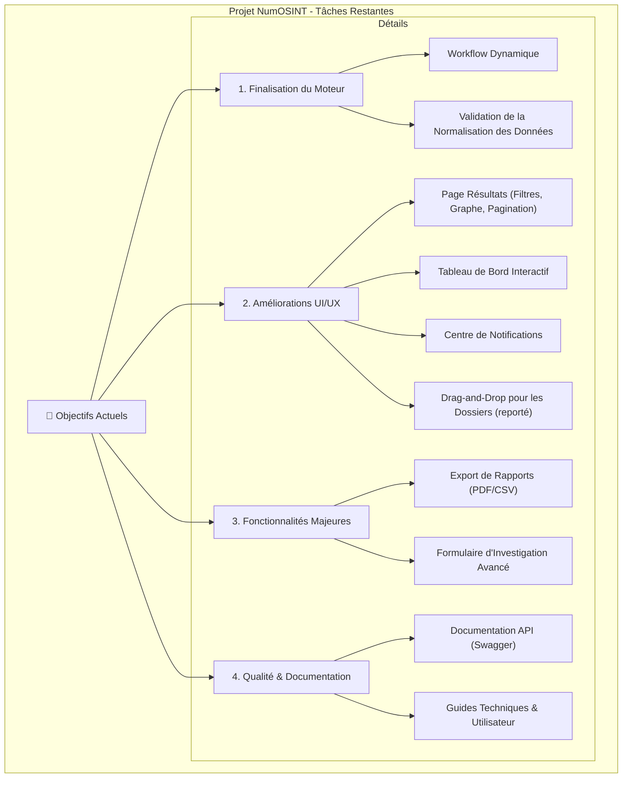

# Liste des Tâches et Améliorations pour NumOSINT

Ce document centralise les prochaines étapes de développement pour faire évoluer la plateforme.

---

## 🎯 Objectifs Actuels

### 1. Finalisation du Moteur d'Investigation
- [ ] **Workflow Dynamique** : Implémenter la logique de l'orchestrateur pour lancer les outils pertinents en fonction des données d'entrée initiales (cf. `PLAN.md`).
- [ ] **Normalisation des Données** : Valider et finaliser la transformation des données brutes de chaque outil en un format unifié pour la base de données.

### 2. Améliorations UI/UX
- [ ] **Page de Résultats**
    - [x] Ajouter des filtres avancés (par date, type de résultat, outil).
    - [x] Implémenter la pagination ou un défilement infini pour gérer de grands volumes de résultats.
    - [ ] Développer la vue "graphique" des relations entre les indicateurs (ex: avec `react-flow`).
- [ ] **Tableau de Bord**
    - [ ] Rendre les cartes de statistiques cliquables pour filtrer les vues.
    - [ ] Ajouter des graphiques d'évolution (ex: nombre d'investigations par semaine).
- [ ] **Centre de Notifications**
    - [ ] Ajouter une icône "cloche" dans la barre de navigation.
    - [ ] Créer une page `/notifications` pour l'historique des alertes.
    - [ ] Permettre de marquer les notifications comme lues/non lues.
- [ ] **Gestion des Dossiers**
    - [ ] Intégrer une bibliothèque de drag-and-drop (ex: `dnd-kit`) pour réorganiser les investigations entre les dossiers (reporté).
- [ ] **Aide et Guidage**
    - [ ] Ajouter des infobulles (`Tooltip`) sur les fonctionnalités complexes.
    - [ ] Créer une page d'aide ou une modale de bienvenue.

### 3. Fonctionnalités Majeures
- [ ] **Exportation de Rapports**
    - [ ] Ajouter un bouton "Exporter" sur les pages d'investigation et de dossier.
    - [ ] Implémenter la logique backend pour générer des rapports PDF et CSV/XLSX.
- [ ] **Formulaire d'Investigation Avancé**
    - [ ] Mettre en place une validation en temps réel du format des indicateurs.
    - [ ] Permettre de sauvegarder et charger des "modèles" d'investigation (ex: un modèle pour "recherche de personne" qui pré-remplit certains champs).

### 4. Qualité et Documentation
- [ ] **Documentation Technique**
    - [ ] Générer et documenter l'API avec Swagger/OpenAPI.
    - [ ] Rédiger un guide de déploiement et d'architecture détaillé.
- [ ] **Documentation Utilisateur**
    - [ ] Rédiger un manuel d'utilisation complet et une FAQ.

---

- [ ] il faudrait que dans le tableau des résultats, on est un sous tableau par investagion, que ce tableau soit aussi présent dans la page des investigation mais focus sur l'investigation ouverte. dans ce tableau on aura non plus que la liste des compte trouvé mais un résumer de tout ce qui à été trouvé avec des liens si possible vers le détails de chaque élément, il regroupera ligne par ligne les compte trouvé, numéro, photo, site, ip, etc toutes les informations mais présenter ligne par ligne dans le tableau, avec en plus de la colonne catégorie une colonne type avec une icone lié au type de donnée trouvé.

