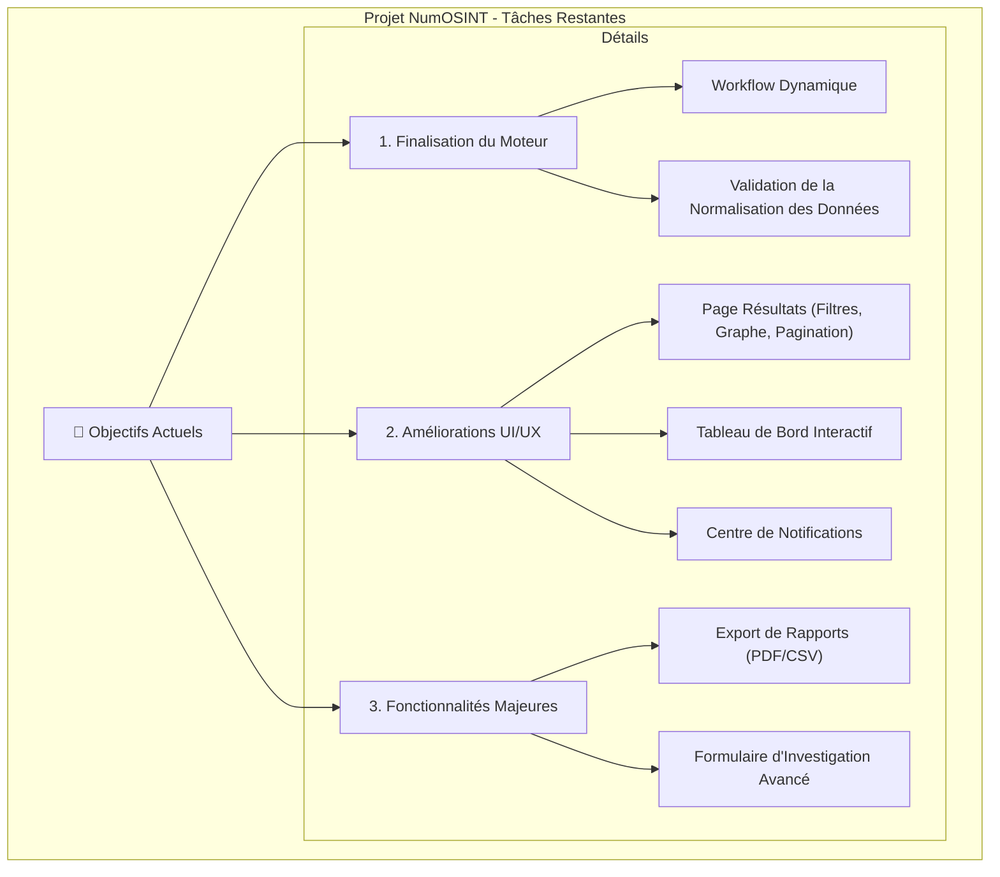

# NumOSINT : Plan Stratégique & Roadmap

## 0. Tableau de Bord de l'Analyse (Ré-analyse en cours)

*Ce tableau suit l'avancement de la nouvelle analyse complète du projet.*

| Domaine du Projet | ✅ Statut de l'Analyse | 🔍 Contenu Détaillé de l'Analyse |
| :--- | :---: | :--- |
| **--- Couche Frontend ---** | | |
| **UI & Accessibilité (a11y)** | 🟢 **Approfondie** | **Structure HTML non sémantique** (div-itis), **Actions non accessibles** (`div` avec `onClick`), **Icônes muettes** (pas d'alternatives textuelles). |
| **Gestion d'État (State)** | 🟢 **Approfondie** | **"God Hook" `useInvestigation`** (+400 lignes), **Store Zustand monolithique** (mélange état client/serveur), **Duplication d'états** locaux dans les composants. |
| **Logique de Fetching** | 🟢 **Approfondie** | **Pattern manuel et répétitif** (`useState`/`useEffect`/`fetch`), **Absence de cache** (re-téléchargements constants), **Gestion complexe des mutations**. |
| **--- Couche Backend ---** | | |
| **API & Sécurité** | 🟢 **Approfondie** | **Absence totale d'authentification**, **Validation des données inconsistante**, **Pas de gestion d'erreurs globale**. |
| **Logique Métier (Orchestrateur)** | 🟢 **Approfondie** | **Duplication de logique critique** (deux orchestrateurs), **Workflow codé en dur** (`switch`/`if`), **Couplage fort** aux services d'outils. |
| **Services d'Outils OSINT** | 🟢 **Approfondie** | **Code répétitif systématique** dans chaque service (configuration, appels `axios`, gestion des erreurs, sauvegarde des résultats). |
| **--- Base de Données ---** | | |
| **Schéma & Structure (SQL)** | 🟢 **Approfondie** | **Typage faible** (`VARCHAR` vs `ENUM`), **Nettoyage dangereux** (`DELETE` vs archivage), **Indexation JSONB inefficace**. |
| **Migrations & Modèles (Prisma)** | 🟢 **Approfondie** | **Divergence avec le SQL** (`init-db.sql` obsolète), **Indexation incomplète** dans le schéma Prisma. |
| **--- Infrastructure & DevOps ---** | | |
| **Configuration Docker** | 🟢 **Approfondie** | **Faille de sécurité majeure** (exécution en `root`), **Images non optimisées** (pas de multi-stage builds), **Cache inefficace**. |
| **Reverse Proxy (Nginx)** | 🟢 **Approfondie** | **Sécurité insuffisante** (manque d'en-têtes modernes), **Performance non optimisée** (pas de compression), **Pas de rate limiting**. |
| **Tests & CI/CD** | 🟢 **Approfondie** | **Couverture de tests quasi nulle**, **Tests d'intégration "factices"** (testent des mocks, pas l'API), **Absence totale de CI/CD**. |

---

## 1. Vision Stratégique & Métriques de Succès

Ce document centralise la stratégie de développement pour faire évoluer la plateforme en réduisant la dette technique et en planifiant les nouvelles fonctionnalités.

### KPIs de Succès
- **Vélocité Équipe**: +40% (Time-to-market pour les features : -50%)
- **Stabilité**: Réduction des bugs en production de 70%.
- **Performance**: Scores Lighthouse > 90.
- **Maintenance**: Réduction de 80% du temps de correction des bugs.
- **Onboarding**: -60% de temps pour intégrer un nouveau développeur.

---

## 2. Plan de Refactorisation : Qualité & Architecture

### 🏗️ Chantiers Architecturaux Restants

#### Chantier G : Qualité et Stratégie de Test
*Met en place les fondations pour garantir la qualité, la non-régression et la stabilité du code sur le long terme.*
- **Problème : Stratégie de Test Incomplète et Inefficace.**
  - **Solution** : Mettre en place une stratégie de tests pyramidale (unitaires, intégration, E2E) et un pipeline de CI de base avec GitHub Actions.
  - **Actions** :
      - [ ] Mettre en place des tests visuels de non-régression.

#### Chantier H : Infrastructure & DevOps
*Améliore la sécurité, la performance et la fiabilité de l'environnement conteneurisé.*

- **Problème #1 : Exécution en tant que `root` dans les Conteneurs.**
  - **Solution** : Créer et utiliser un utilisateur non-privilégié dans chaque `Dockerfile`. (FAIT)

- **Problème #2 : Images Docker Lourdes et Non Optimisées.** (FAIT)
  - **Solution** : Restructurer tous les `Dockerfile` pour utiliser des builds multi-étapes.

- **Problème #3 : Invalidation du Cache Docker Inefficace.** (FAIT)
  - **Solution** : Optimiser l'ordre des commandes pour maximiser l'utilisation du cache Docker.

- **Problème #4 : Configuration Nginx Minimale.**
  - **Solution** : Renforcer la configuration Nginx pour améliorer la sécurité et les performances. (FAIT)

#### Chantier I : Authentification et Gestion des Utilisateurs
*Met en place la brique de sécurité essentielle pour une application multi-utilisateurs.*
- **Problème : Absence totale d'authentification, de gestion des utilisateurs et d'isolation des données.**
  - **Solution** : Intégrer `Auth.js` (NextAuth) pour sécuriser l'application, et modifier le schéma de données pour lier toutes les ressources à un utilisateur.
  - **Actions (Backend & Schéma)**:
      - [ ] **Intégration Auth.js**: Configurer les providers (ex: Credentials, Google) et les callbacks.
      - [ ] **Schéma de DB**: Ajouter le modèle `User` et les relations (`userId`) aux modèles `Investigation`, `Report`, `Alerts`, `Logs`.
      - [ ] **Migration DB**: Créer et appliquer la migration de base de données avec Prisma.
      - [ ] **API Sécurisée**: Protéger tous les endpoints de l'API en vérifiant la session utilisateur.
      - [ ] **Logique Métier**: Modifier tous les services pour que la création/lecture d'entités soit filtrée par `userId`.
  - **Actions (Frontend)**:
      - [ ] **Gestion de Session**: Gérer la session sur le client avec `useSession` et adapter l'UI (ex: header, menus).
      - [ ] **Accès aux Données**: Modifier toutes les fonctions de fetching pour qu'elles opèrent dans le contexte de l'utilisateur authentifié.
      - [ ] **Notifications**: Assurer que les notifications WebSocket sont bien liées à l'utilisateur (via le token déjà en place).

---

## 3. Plan d'Amélioration Continue

### 📊 Performance
- **Frontend**: [ ] Implémenter le debouncing, [ ] Lazy loading, [ ] `React.memo`, [ ] Virtualisation, [ ] Optimisation des images, [ ] Compression des assets.
- **Base de Données**: [ ] Analyse des requêtes lentes, [ ] Indexes composites, [ ] Pagination cursor-based.

### 🧪 Tests et Qualité
- **Tests**: [ ] Tests de performance.
- **Qualité**: [ ] ESLint strict, [ ] Prettier, [ ] Pre-commit hooks, [ ] Analyse statique.

### 📚 Documentation et Maintenance
- **Documentation**: [ ] Architecture (diagrammes), [ ] Guides de contribution, [ ] JSDoc.
- **Monitoring**: [ ] Métriques applicatives, [ ] Alertes, [ ] Dashboard de santé, [ ] APM.

---

## 4. Roadmap des Fonctionnalités

### Objectifs Actuels

### Détails des Fonctionnalités

#### Finalisation du Moteur d'Investigation
- [ ] **Workflow Dynamique** : Implémenter la logique de l'orchestrateur pour lancer les outils pertinents.
- [ ] **Normalisation des Données** : Valider et finaliser la transformation des données brutes en un format unifié.

#### Améliorations UI/UX
- [ ] **Page de Résultats Unifiée**:
    - [ ] Développer la vue "graphique" des relations entre les indicateurs (ex: avec `reactflow`).
    - [ ] Ajouter des filtres avancés (par type, source, confiance).
    - [ ] Mettre en place la pagination ou le défilement infini.
- [ ] **Tableau de Bord Interactif**:
    - [ ] Permettre de cliquer sur les graphiques pour filtrer les données.
    - [ ] Ajouter des options de personnalisation (période, etc.).
- [ ] **Centre de Notifications**:
    - [ ] Créer une page dédiée pour voir toutes les notifications.
    - [ ] Ajouter des actions (marquer comme lu, supprimer).

#### Authentification et Gestion des Utilisateurs
- [ ] **Développement des Pages d'Authentification**:
    - [ ] **Page de Connexion (`/login`)**: Créer le formulaire de connexion.
        - *Composants `shadcn/ui`*: `Card`, `CardHeader`, `CardTitle`, `CardDescription`, `CardContent`, `CardFooter`, `Label`, `Input`, `Button`.
    - [ ] **Page d'Inscription (`/register`)**: Créer le formulaire d'inscription.
        - *Composants `shadcn/ui`*: `Card`, `CardHeader`, `CardTitle`, `CardDescription`, `CardContent`, `CardFooter`, `Label`, `Input`, `Button`.
- [ ] **Personnalisation de l'Expérience Utilisateur**:
    - [ ] Le tableau de bord doit charger uniquement les données de l'utilisateur connecté.
    - [ ] Chaque nouvelle ressource (investigation, rapport, etc.) doit être associée à l'ID de l'utilisateur.
    - [ ] Ajouter un menu profil dans le header affichant l'email de l'utilisateur et un lien de déconnexion.

#### Fonctionnalités Majeures
- [ ] **Export de Rapports (PDF/CSV)**:
    - [ ] Générer un rapport PDF propre et professionnel.
    - [ ] Permettre l'export des données brutes en CSV.
- [ ] **Formulaire d'Investigation Avancé**:
    - [ ] Ajouter la possibilité de sauvegarder/charger des "modèles" d'investigation.
    - [ ] Intégrer des suggestions basées sur les indicateurs saisis.